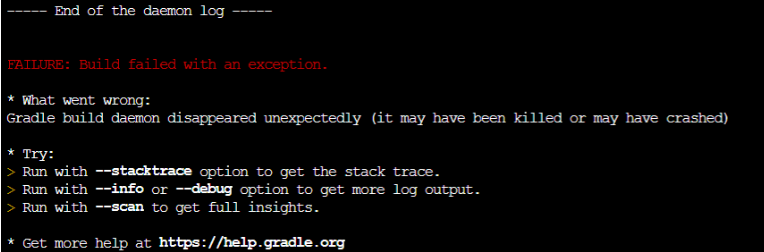

# 진행하면서 생겼던 오류

### 로컬, 서버에서 웹 페이지 실행 시 사용자명 오류
- {userName} : 윈도우의 환경변수
- {user} : ec2에서 ec2-user라는 값만 나오게 됨.

## 해결책

- userName, user라는 이름으로 안 만들고 다른 이름으로 해서 사용자 이름을 표시하는게 좋다.

### putty 실행시 일어났었던 오류

- jar 파일 실행시 ec2에서 프리티어로 제공하는 RAM은 1GB라서 가상메모리라는 개념을 사용했어야 했다.

생긴 오류는 다음과 같이 생겼다.

??!

### 해결책

이 부족한 부분을 디스크의 일부를 대신 사용하도록 설정해줌 으로써 해결하는 방법이다. 가상메모리를 사용하는 것이다.

가상 메모리 = 물리 메모리 + 하드디스크의 swap영역 활용

- sudo dd if=/dev/zero of=/mnt/swapfile bs=1M count=2048
- sudo mkswap /mnt/swapfile
- sudo swapon /mnt/swapfile

위 세 개의 명령어를 순서대로 입력하면 스왑 메모리가 생성된다. 이렇게 해주면 스왑 메모리가 2GB 잡혀서 메모리 부족으로 빌드가 멈추는 현상은 사라지지만, 디스크는 RAM 보다 훨씬 속도가 느리기 때문에 서비스에 퍼포먼스 문제가 발생할 수 있다고 한다. 그래서 이 방법은 임시방편으로 쓰고 사양을 올려야 한다.

이것을 통해서 cs가 왜 중요한지 다시금 깨닫게 되었다.

### 출처
- https://progdev.tistory.com/26

## 배포시 S3 랑 Github Action 사용

- Travis CI 를 사용하려고 했는데 결제 방식이 조금 달라져서 바로 진행이 안되서 github Action으로 진행
- 계속 빌드하다가 Could not load credentials from any providers 문제 발생
  - 위 문제 발생시 확인해야 할 것!
    - permission의 권한을 줬는지 : https://github.com/aws-actions/configure-aws-credentials/issues/271
  - aws key 에 대한 설정을 repository secret에서 잘 했는지 꼭 확인하기!

### 출처(아래 링크를 참고하면서 진행)
- https://github.com/jojoldu/freelec-springboot2-webservice/issues/806

## CodeDeploy 관련 에이전트 설치시 

책에 있는 명령어를 사용하면 안 됨 그래서
`wget https://aws-codedeploy-ap-northeast-2.s3.ap-northeast-2.amazonaws.com/latest/install`

해당 명령어를 사용해야함.

### 출처 
- https://github.com/jojoldu/freelec-springboot2-webservice/issues/308

## yum 에서는 java11 이 적용이 안된다??!!!

> yum? : RPM 기반의 시스템을 위한 자동 업데이터 겸 패키지 설치/제거 도구

그래서 실행하게 되면 다음과 같은 오류를 확인할 수 있다.

`has been compiled by a more recent version of the Java Runtime (class file version 55.0), this version of the Java Runtime only recognizes class file versions up to 52.0`

**위 말을 간단히 해석하자면 코드는 11번으로 실행을 해야되는데 여기 putty에는 8버전밖에 없다고 한다.**

그리고 aws에서는 그래서 corretto 11 이라고 자바 11을 진행할 수 있도록 도와준다. 설치 방법은 아래의 여기를 참고하자.

yum에는 설치가능한 JDK가 1.8까지만 존재하기 때문에 JDK 11을 설치하기 위해선 다른 방법을 이용해야합니다.
Amazon에서 제공하는 OpenJDK인 Amazon Coretto를 다운받아 간편하게 설치할 수 있습니다.
yum list java*jdk-devel # 설치 가능한 jdk 확인
> - java-1.6.0-openjdk-devel.x86_64                                       1:1.6.0.41-1.13.13.1.77.amzn1                                       amzn-main
> - java-1.7.0-openjdk-devel.x86_64                                       1:1.7.0.261-2.6.22.1.83.amzn1                                       amzn-updates
> - java-1.8.0-openjdk-devel.x86_64                                       1:1.8.0.252.b09-2.51.amzn1                                          amzn-updates

### JDK 설치
 aws coreetto 다운로드

`sudo curl -L https://corretto.aws/downloads/latest/amazon-corretto-11-x64-linux-jdk.rpm -o jdk11.rpm`

###  jdk11 설치
`sudo yum localinstall jdk11.rpm`

### jdk version 선택
`sudo /usr/sbin/alternatives --config java`

### java 버전 확인
`java --version`

### 다운받은 설치키트 제거
`rm -rf jdk11.rpm`

### 이전 버전 제거하기
`yum list installed | grep "java"` yum 설치 리스트 확인
> - java-1.8.0-openjdk-headless.x86_64    1:1.8.0.222.b10-0.47.amzn1   @amzn-updates
> -  java-11-amazon-corretto-devel.x86_64  1:11.0.7.10-1                installed

`sudo yum remove java-1.8.0-openjdk-headless.x86_64`

### 출처
- https://pompitzz.github.io/blog/Java/awsEc2InstallJDK11.html#jdk-%E1%84%89%E1%85%A5%E1%86%AF%E1%84%8E%E1%85%B5

