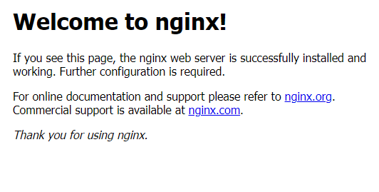
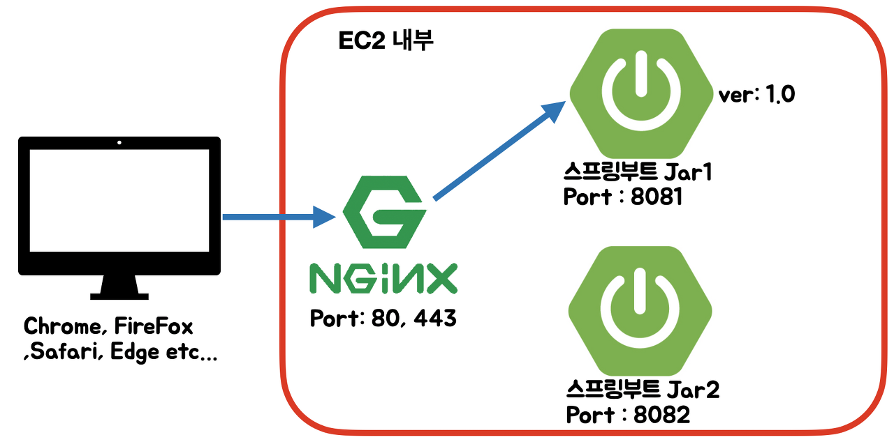
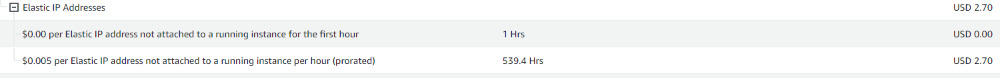

## 스프링 부트와 AWS로 혼자 구현하는 웹 서비스를 진행하면서 생겼던 오류 및 해결방안


### 로컬, 서버에서 웹 페이지 실행 시 사용자명 오류
- {userName} : 윈도우의 환경변수
- {user} : ec2에서 ec2-user라는 값만 나오게 됨.


### 해결책

- userName, user라는 이름으로 안 만들고 다른 이름으로 해서 사용자 이름을 표시하는게 좋다.


---

### putty 실행시 일어났었던 오류

- jar 파일 실행시 ec2에서 프리티어로 제공하는 RAM은 1GB라서 가상메모리라는 개념을 사용했어야 했다.

생긴 오류는 다음과 같이 생겼다.


??!

### 해결책

이 부족한 부분을 디스크의 일부를 대신 사용하도록 설정해줌 으로써 해결하는 방법이다. 가상메모리를 사용하는 것이다.

가상 메모리 = 물리 메모리 + 하드디스크의 swap영역 활용

- sudo dd if=/dev/zero of=/mnt/swapfile bs=1M count=2048
- sudo mkswap /mnt/swapfile
- sudo swapon /mnt/swapfile

위 세 개의 명령어를 순서대로 입력하면 스왑 메모리가 생성된다. 이렇게 해주면 스왑 메모리가 2GB 잡혀서 메모리 부족으로 빌드가 멈추는 현상은 사라지지만, 디스크는 RAM 보다 훨씬 속도가 느리기 때문에 서비스에 퍼포먼스 문제가 발생할 수 있다고 한다. 그래서 이 방법은 임시방편으로 쓰고 사양을 올려야 한다.

이것을 통해서 cs가 왜 중요한지 다시금 깨닫게 되었다.

### 출처
- https://progdev.tistory.com/26

---

## 배포시 S3 랑 Github Action 사용

- Travis CI 를 사용하려고 했는데 결제 방식이 조금 달라져서 바로 진행이 안되서 github Action으로 진행
- 계속 빌드하다가 Could not load credentials from any providers 문제 발생
  - 위 문제 발생시 확인해야 할 것!
    - permission의 권한을 줬는지 : https://github.com/aws-actions/configure-aws-credentials/issues/271
  - aws key 에 대한 설정을 repository secret에서 잘 했는지 꼭 확인하기!


### 출처(아래 링크를 참고하면서 진행)
- https://github.com/jojoldu/freelec-springboot2-webservice/issues/806

---

## CodeDeploy 관련 에이전트 설치시 

책에 있는 명령어를 사용하면 안 됨 그래서
`wget https://aws-codedeploy-ap-northeast-2.s3.ap-northeast-2.amazonaws.com/latest/install`

해당 명령어를 사용해야함.


### 출처 
- https://github.com/jojoldu/freelec-springboot2-webservice/issues/308

---


## yum 에서는 java11 이 적용이 안된다??!!!

> yum? : RPM 기반의 시스템을 위한 자동 업데이터 겸 패키지 설치/제거 도구


그래서 실행하게 되면 다음과 같은 오류를 확인할 수 있다.

`has been compiled by a more recent version of the Java Runtime (class file version 55.0), this version of the Java Runtime only recognizes class file versions up to 52.0`

**위 말을 간단히 해석하자면 코드는 11번으로 실행을 해야되는데 여기 putty에는 8버전밖에 없다고 한다.**

그리고 aws에서는 그래서 corretto 11 이라고 자바 11을 진행할 수 있도록 도와준다. 설치 방법은 아래의 여기를 참고하자.


yum에는 설치가능한 JDK가 1.8까지만 존재하기 때문에 JDK 11을 설치하기 위해선 다른 방법을 이용해야합니다.
Amazon에서 제공하는 OpenJDK인 Amazon Coretto를 다운받아 간편하게 설치할 수 있습니다.
yum list java*jdk-devel # 설치 가능한 jdk 확인
> - java-1.6.0-openjdk-devel.x86_64                                       1:1.6.0.41-1.13.13.1.77.amzn1                                       amzn-main
> - java-1.7.0-openjdk-devel.x86_64                                       1:1.7.0.261-2.6.22.1.83.amzn1                                       amzn-updates
> - java-1.8.0-openjdk-devel.x86_64                                       1:1.8.0.252.b09-2.51.amzn1                                          amzn-updates

### JDK 설치
 aws coreetto 다운로드

`sudo curl -L https://corretto.aws/downloads/latest/amazon-corretto-11-x64-linux-jdk.rpm -o jdk11.rpm`

###  jdk11 설치
`sudo yum localinstall jdk11.rpm`

### jdk version 선택
`sudo /usr/sbin/alternatives --config java`

### java 버전 확인
`java --version`

### 다운받은 설치키트 제거
`rm -rf jdk11.rpm`

### 이전 버전 제거하기
`yum list installed | grep "java"` yum 설치 리스트 확인
> - java-1.8.0-openjdk-headless.x86_64    1:1.8.0.222.b10-0.47.amzn1   @amzn-updates
> -  java-11-amazon-corretto-devel.x86_64  1:11.0.7.10-1                installed

`sudo yum remove java-1.8.0-openjdk-headless.x86_64`

### 출처
- https://pompitzz.github.io/blog/Java/awsEc2InstallJDK11.html#jdk-%E1%84%89%E1%85%A5%E1%86%AF%E1%84%8E%E1%85%B5

---




## 이 화면이 뜰 때만 해도 금방 끝날 거라고 생각했었죠.....


## Nginx

우선 발생한 오류와 해결방법을 말하기 전에 이 친구에 대해서 먼저 말하고 갈려고 한다. 왜냐하면 오류를 해결하는데 이 친구가 어떤 역할을 하는지에 대해서 이해가 된 이후에서야 점차 오류에 대한 이해가 되었기 때문이다.

### Nginx에 대해 알아보기 전...

위 같은 것을 사용하는 시발점이 어디서부터였을까?

책의 챕터의 제목과 같이 무중단 배포를 하기 위해서이다.

예를 들면 이런 상황인거다.
- 웹 서비스를 하고 있는데 만약 패치를 해야하는 상황이 찾아온다면? 원래라면 그냥 서비스를 잠깐 정지시키고 해야한다.
- 웹 서비스에서 치명적인 문제가 발생했는데 서버를 정지시켜야 할 경우 -> 롤백조차 어려울 수도 있다고 한다.(ㅠㅠㅠㅠ)

그래서 서비스를 정지시키지 않고, 무중단 배포라는것을 하게 된 것이다.

책에서 그래서 Nginx라는 도구를 사용한다.
> Nginx는 경량 웹 서버입니다.
클라이언트로부터 요청을 받았을 때 요청에 맞는 정적 파일을 응답해주는 HTTP Web Server로 활용되기도 하고,
`Reverse Proxy Server`로 활용하여 WAS 서버의 부하를 줄일 수 있는 로드 밸런서로 활용되기도 합니다.


이 기능 중 주로 리버스 프록시 서버로서 활용을 하고 사용을 한다.
>리버스 프록시 : 외부의 요청을 받아 백엔드 서버로 요청을 전달하는 행위이다.

client -> nginx -> server 이런식으로 요청을 받는거다. 그런데 이것을 유지하기 위한 ec2가 더 필요한게 아니라 이제 우리가 서버 운영을 할 때 **하나의 nginx 한 대와 스프링 부트 Jar 2개를 사용하는 거다.**



https://jojoldu.tistory.com/267?category=635883


그래서 계속 동작하게 할 건데 평소엔 8081포트로 보내주고 있다가 새로 배포하는 것을 8082포트에 올리고 갈아끼워주는 형식으로 계속 동작하는것이라고 이해했다!


## 그래서 설정하다가 일어난 문제들

### 1. 쉘 스크립트 관련 오류들

쉘 스크립트가 아직 익숙하지 않다보니 책을 보며 스크립트를 따라 적고 있었는데 오류가 일어났었다. 물론 친절한 intellij처럼 알려주지 않았지만 error로그를 남겨줘서 하나 하나 찾으며 수정했었다.
- 오류 발견하는 방법 [오류 발견 관련 글 참고](https://my-first-programming.tistory.com/entry/nginx-%EC%9E%AC%EC%8B%9C%EC%9E%91-%EC%98%A4%EB%A5%98)
  - `sudo nginx -t`를 사용하여 nginx 시작시 어떤 오류들이 뜨게 되는지 알 수 있다. 
- 실제 가장 많이 발생했던 오류 [가장 많이 발견된 글](https://velog.io/@jhkang1517/Trouble-Shooting-Error-unary-operator-expected
  )
  - 항상 쉘 스크립트 타이핑을 할 때에는 조~~심해서 꼭 하자.


### 2. nginx에서 포트를 switch 하는 과정

- /etc/nginx/conf.d/service-url.inc 라는 것을 건드려서 프록시 설정을 해줘야하는데...
  - 그 안에 
  - ``` shell
    include /etc/nginx/conf.d/service-url.inc'
    
    location / {
     proxy_pass $service_url;
     proxy_set_header X-Real-IP $remote_addr;
     proxy_set_header X-Forwarded-For $proxy_add_x_forwarded_for;
     proxy_set_header Host $http_host;
    
    }
    
- 위 구문을 사용하는데 잘 아주 잘 작성을 해야한다. 원래는 위에 include문이 하나 더 있는데 그걸 안 지우고 진행했다가 ... 가리키는 곳이 겹쳐서 port번호를 바꿔줘야 할 때 바꿔주지 않는 일이 있었다.
    


### 3. putty에는 nginx를 깔겠다고 바로 sudo yum install nginx 하면 설치 하지 않는다.

- 제목 그대로 설치를 안하고 putty에서 다른 추천 명령어를 던져주는데 그것을 설치하면 된다.
  - `nginx is available in Amazon Linux Extra topic "nginx1" To use, run  sudo amazon-linux-extras install nginx1`
  - 이런 멘트가 나오는데 `sudo amazon-linux-extras install nginx1` 이 친구를 깔면 된다. 
  - 왜 이렇게 됬냐 했더니 설치한 OS가 AMI인 경우 위 명령어로 nginx를 깔아줘야 한다고 한다.
    - AMI? : Amazon Machine Image(AMI)는 인스턴스를 시작하는 데 필요한 정보를 제공하는 AWS에서 지원되고 유지 관리되는 이미지입니다.


이렇게 3 가지를 작성했지만 가장 인상깊었던 것은  `쉘 스크립트 사용할때 진짜 진짜 잘 주의깊게 사용하자는 거였다.`


### 갑자기 인스턴스 중지시켰는데 돈이 나감? 



갑자기 진짜 돈이 나가버렸다. 그래서 왜 나갔을지 계속 알아보고 있었다. ㅠㅠ


**이유를 찾아보니 다음과 같았다**
> 1. 탄력적 IP주소는 EC2 인스턴스에 연결되어 있어야 한다.
> 2. 그 연결된 인스턴스가 실행중이어야 한다.
> 3. 인스턴스에 연결 된 탄력적 IP 주소가 하나뿐이어야 한다.

**즉 인스턴스 중지를 시켜버리거나 종료를 시켜버린뒤 탄력적 IP를 놔두면 계속 낭비되는 것이라고 생각하고 돈이 계속 나가게 된다. 그래서 사용하지 않는다면 바로 탄력적 IP를 연결을 해제 한 후 릴리스를 통해 제거해야 추가 비용이 발생하는 것을 방지할 수 있다.**


### 실수로 돈 나갔을 때 환불 받는 방법

**AWS 홈 -> ?모양의 지원 -> 지원 센터 Create Case 클릭 -> Type: Billing -> Category : Payment Issue 선택 -> Subject에 환불 요청 제목 작성 -> Description에 환불에 대한 내용 작성 -> Contact Options Web -> 이메일로 답변온다.**


