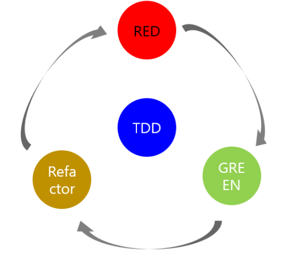

## [복습] Ch02 정리


### 스프링 부트에서 테스트 코드를 작성을 하는 습관을 길러보자!


이 파트에서는 TDD에 대한 설명에 대해서 설명해주신다. TDD가 무엇일까?

> TDD: TDD란 Test Driven Development의 약자로 ‘테스트 주도 개발’이라고 한다.

그래서 이 개념과 함께 매번 이 그림이 함께 나온다.



이 그림을 보면
- RED: 항상 실패하는 테스트를 먼저 작성한다.
- GREEN: 테스트가 통과하는 프로덕션 코드를 작성한다.
- Refactor: 테스트가 통과하면 프로덕션 코드를 리팩토링한다.

라는 순환되는 구조로 계속 진행이 된다. 그래서 책에서 TDD와 단위 테스트는 다른 개념이기에 이번에는 우선 단위 테스트를 어떻게 학습하는지 알고 난 이후 TDD를 알아보라고 추천을 해주신다.


### 왜 테스트 코드라는 것을 계속 확인해야할까? 디버깅 하면 되지 않을까?

위 질문이 나는 처음 들었었다. 그래서 책에서 말하길 다음과 같은 과정들을 다 거쳐야지만 코드가 제대로 수행되고 있는지 확인할 수 있다.

- 코드를 작성
- 프로그램(Tomcat)을 실행
- Postman과 같은 API 테스트 도구로 HTTP 요청
- 요청 결과를 System.out.println()으로 눈으로 확인해야한다.
- 결과가 다르면 다시 프로그램(Tomcat)을 중지하고 코드를 수정해야 한다.

이번에 코드를 따라 쳐보면서 테스트를 하지 않고 진행을 하면서 확인했을 때 매번 Tomcat을 껏다 켰다가 하는 시간들이 어찌보면 너무 답답했다.(매번 이 과정을 진행하면 30초씩은 기다렸었다.)

그래서 위와 같이 간단하게 어떤 간단한 로직 하나만 진행한다해도 시간소모가 심하다. 그래서 테스트 코드를 작성할 수 있다면은 **이런 시간적인 부분을 절약할 수 있다.**

그리고 시간이 절약되는 것 포함한 테스트가 이점이 있는 이유는 다음과 같다.

- 빠른 피드백을 받을 수 있다.(시간 단축)
- System.out.println()을 통해 눈으로만 확인해야 하지 않아도 된다.
  - 테스트 코드가 잘 실행됬는지 통과, 실패로 바로 보여주기 때문이다.
- 개발자가 만든 기능을 안전하게 보호해준다.
  - B를 추가하려고 했는데 기존 그냥 실행할 때 A가 갑자기 잘못되버릴 수 있기 때문에 기능을 보호한다고 말한다.
  - 새 기능이 추가될 때 기존 기능이 잘 작동되는 것을 보장해 준다.


그래서 항상 서비스 기업에서는 특히 테스트 코드를 잘 작성하는 사람을 원한다. 그렇기에 테스트 코드를 쓰는 습관을 길러야 한다.

그 중 테스트 프레임워크로 `xUnit`이 있는데
- Junit : Java
- DBUnit : DB
- CppUnit : C++
- NUnit : .net

그래서 대표적인 것들이 있었는데 현재 JUnit5까지 나와있었다. 

그래서 이 장에서 대표적인 코드가 다음이다.
```java
@RunWith(SpringRunner.class)
@WebMvcTest
public class HelloControllerTest {

    @Autowired
    private MockMvc mvc;


    @Test
    public void hello_리턴() throws Exception {
        String hello = "hello";
        mvc.perform(get("/hello")).
            andExpect(status().isOk()).
            andExpect(content().string(hello));
    }
}
```

물론 main에 있는 코드에는 GetMapping에 /hello라는 곳으로 get요청 오면 hello라고 response하기로 해놨다.

- `@RunWith(SpringRunner.class)`를 통해 스프링 실행자를 사용한다, 스프링 부트 테스트와 JUnit 사이에 연결자 역할을 한다.
- `@WebMvcTest(controllers = HelloController.class)` Web에 집중할 수 있는 어노테이션이다. @Controller, @ControllerAdvice 등 사용할 수 있는 것이 있다.
  - 그렇지만 `@Service`, `@Repository`, `@Component`를 사용할 수 없다. 여기서는 컨트롤러만 사용하기 때문에 선언을 하였다.
- `MockMvc mvc`라는 것을 통해서 웹 API 테스트를 할 수 있어서 따로 서버를 키지 않아도 확인을 할 수 있었다.
- mvc.perform이라는 것을 통해서 안쪽에 있는 GET방식으로 /hello로 요청을 보내고 status를 확인해서 상태코드가 200을 받았는지 확인 한 후 hello라는 것이 응답안에 있는지 확인을 한다.


이제 위 코드에 이어서 있는 아래의 테스트 코드인데 컨트롤러에서는 딱히 다른 기능은 없고 객체(name, amount)를 반환하는 것이다.
```java
    @Test
    @WithMockUser(roles="USER")
    public void responseDto_테스트() throws Exception {
        String name="hello";
        int amount=10000;
        mvc.perform(get("/hello/dto").param("name", name).param("amount", String.valueOf(amount))).
            andExpect(status().isOk()).
            andExpect(jsonPath("$.name").value(name)).
            andExpect(jsonPath("$.amount").value(amount));

        // 책에서의 내용과 달라짐 andExpect(jsonPath(("$.name"), is(name))) ->  andExpect(jsonPath("$.name").value(name)).
        // 레퍼런스 참고 : https://docs.spring.io/spring-framework/docs/current/javadoc-api/org/springframework/test/web/servlet/result/JsonPathResultMatchers.html
        // 언젠지는 모르지만 is로 확인하지 않고 value로 확인해서 resultMatcher를 이용하여서 하는 방식으로 전환됨.
    }
```

위의 코드는 이제 객체를 반환했을때 어떻게 되는지 확인하는 테스트이다.

- JsonPath
  - Json 응답값을 필드별로 검증할 수 있는 메서드이다.
  - $를 기준으로 필드명을 명시한다.


**언젠지는 모르지만 책에 나온 is로 확인하지 않고 value로 확인해서 resultMatcher를 이용하여서 하는 방식으로 전환됨.**


위 두 코드를 작성하면서 느낀 것은 정말 API를 작성하고 하는데 코드를 고칠 때마다 확인하기 위해서 매번 내장 Tomcat을 켜고 끄는 것을 안하니까 시간적으로 엄청 아낄 수 있었다는 것을 많이 느낄 수 있었던 챕터였고, 즉각적으로 기능이 맞는지 아닌지 한 눈으로 알 수 있었으니 테스트 코드를 습관화 시켜야겠다.


